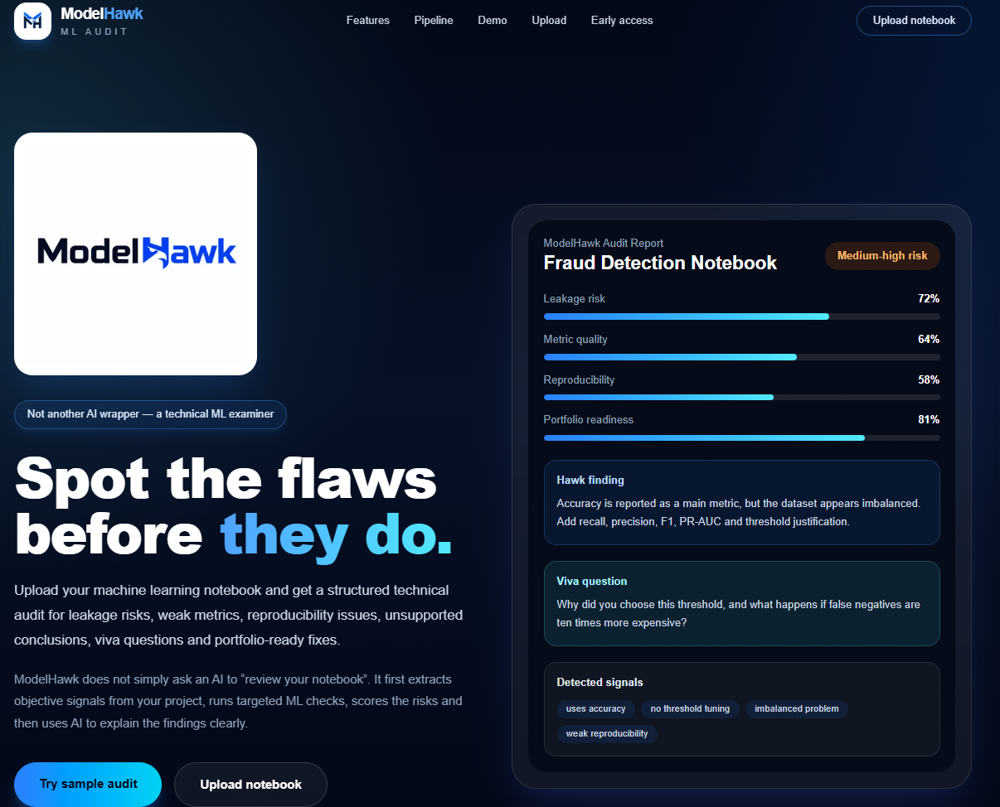
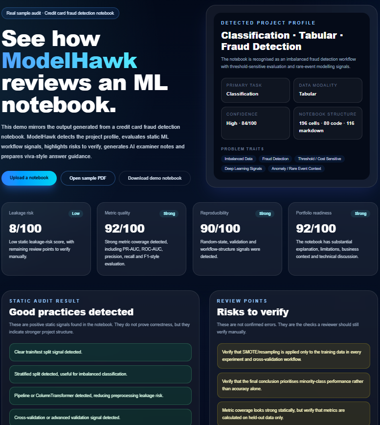

<p align="center">
  
</p>

<h1 align="center">ModelHawk</h1>

<p align="center">
  <strong>Static ML notebook auditing with AI examiner notes and professional LaTeX PDF reports.</strong>
</p>

<p align="center">
  <a href="https://github.com/albertoreyescastro/modelhawk">
    
  </a>
  
  
  
  
  
</p>

---

## Overview

**ModelHawk** is a personal AI/ML technical prototype that analyses Jupyter notebooks through static audit rules, detects machine-learning workflow signals, highlights likely risks, generates AI-assisted examiner notes, and exports professional PDF audit reports.

The project combines:

- **Next.js** and **TypeScript** for the web application
- **Static notebook analysis** for deterministic ML workflow checks
- **Gemini API** for hosted AI examiner notes when configured
- **Ollama** as an optional local AI fallback
- **Deterministic fallback logic** when no AI provider is available
- **LaTeX / pdflatex** for professional PDF report generation
- **Portfolio-oriented ML review logic** for technical documentation and interview preparation

ModelHawk is currently a prototype and should be interpreted as technical guidance, not as a guarantee of notebook correctness.

---

## Live prototype demo

A temporary live prototype may be available here:

[Open ModelHawk live demo](https://website-respondents-jaguar-opened.trycloudflare.com)

> **Demo availability note**  
> This prototype is currently exposed through a temporary Cloudflare Tunnel from my local development machine.  
> The link only works while my local terminal, Next.js server and tunnel are running.  
> If the link is offline, the code can still be reviewed and run locally using the instructions below.

---

## Screenshots

### Landing page



### Notebook upload workflow


### Static audit results


### AI examiner notes


### LaTeX PDF report


### Demo page



---

## Demo notebook

You can test ModelHawk using the sample fraud detection notebook included in this repository:

[Download demo notebook: credit_card_fraud_detection.ipynb](./public/examples/credit_card_fraud_detection.ipynb)

Recommended test flow:

1. Open the live prototype or run the project locally.
2. Go to the **Upload Notebook** page.
3. Upload `credit_card_fraud_detection.ipynb`.
4. Run the static audit.
5. Review the detected project profile, scores, findings, risks, recommendations and AI examiner notes.
6. Download the generated PDF report.

The demo notebook is a machine-learning project focused on:

- credit card fraud detection
- imbalanced classification
- preprocessing
- model comparison
- threshold selection
- precision/recall evaluation
- PR-AUC and ROC-AUC style model assessment

---

## Sample PDF report

A sample generated audit report is included here:

[Open sample ModelHawk PDF report](./public/docs/reports/modelhawk-sample-audit-report.pdf)

The PDF report is generated through the ModelHawk PDF route using LaTeX.

---

## What ModelHawk does

ModelHawk performs a static analysis of uploaded `.ipynb` notebooks.

It does **not** execute notebook code. Instead, it parses notebook content and searches for technical signals related to machine-learning project quality.

Current capabilities include:

- detecting the likely ML project profile
- identifying the primary task, such as classification
- detecting data modality, such as tabular data
- recognising problem traits such as class imbalance, fraud detection, threshold-sensitive evaluation or deep learning signals
- detecting ML workflow signals such as:
  - train/test split
  - train/validation split
  - stratified split
  - cross-validation
  - random seeds
  - pipelines or `ColumnTransformer`
  - SMOTE or resampling
  - baseline models
  - hyperparameter search
  - PR-AUC, ROC-AUC, precision, recall and F1 evaluation
  - threshold tuning
  - markdown explanation and limitations sections
- producing heuristic audit scores
- highlighting good practices
- highlighting risks to verify
- suggesting priority fixes and notebook improvements
- generating viva/interview preparation questions
- generating AI examiner notes from the structured audit result
- exporting a professional PDF audit report compiled with LaTeX

---

## Example output

When tested with the included credit card fraud detection notebook, ModelHawk detects a profile similar to:

```text
Primary task: Classification
Data modality: Tabular
Problem traits: Imbalanced Data, Fraud Detection, Threshold/Cost Sensitive, Deep Learning
Confidence: High
```

Example audit dimensions:

```text
Leakage risk
Metric quality
Reproducibility
Portfolio readiness
```

Example review points include:

```text
Verify that SMOTE/resampling is applied only to the training data.
Check that final conclusions prioritise minority-class performance.
Verify that metrics are calculated on held-out data only.
```

---

## AI examiner layer

ModelHawk includes an AI examiner layer that converts deterministic audit results into clearer technical review notes.

The AI layer does **not** replace the deterministic audit engine. It uses the structured audit result as evidence and produces clearer explanations, recommendations and viva-style answer guidance.

Current provider order:

```text
GEMINI_API_KEY configured
  ↓
Use Gemini API

No Gemini key or Gemini temporarily unavailable
  ↓
Use Ollama if OLLAMA_URL is configured

No external/local provider available
  ↓
Use deterministic ModelHawk fallback examiner
```

The intended architecture is:

```text
Notebook
  ↓
Static parser and deterministic audit rules
  ↓
Structured audit JSON
  ↓
AI examiner notes
  ↓
Web report and PDF report
```

The AI examiner can generate:

- executive summaries
- technical assessments
- risk interpretations
- portfolio-oriented verdicts
- improved recommendations
- suggested markdown cells
- viva/interview answer guidance
- audit limitations

If the primary AI provider is temporarily unavailable, ModelHawk can show an AI provider notice and use a fallback examiner instead.

---

## PDF report generation

ModelHawk can export a professional PDF report using a LaTeX backend.

The PDF report includes:

- cover page
- executive summary
- detected project profile
- notebook structure
- audit scores
- findings
- good practices
- risks to verify
- recommendations
- suggested notebook improvements
- AI examiner notes when available
- viva questions and answer guidance
- detected technical signals

The PDF generator currently depends on a local LaTeX installation such as **MiKTeX** on Windows. A production-friendly LaTeX workflow is planned so that PDF generation does not depend on a local machine.

---

## Tech stack

### Frontend and backend

- Next.js
- React
- TypeScript
- API routes
- Tailwind CSS-style utility classes

### AI examiner

- Gemini API when configured
- Ollama as an optional local fallback
- Deterministic fallback examiner
- Structured JSON-style AI output
- Provider fallback notices

### Report generation

- LaTeX
- `pdflatex`
- Professional PDF report compilation

### ML audit logic

- Static notebook parsing
- Rule-based signal detection
- Heuristic scoring
- Project profile inference
- ML workflow quality checks

---

## Project structure

```text
modelhawk
├── app
│   ├── api
│   │   ├── audit
│   │   │   ├── route.ts
│   │   │   └── ai
│   │   │       └── route.ts
│   │   └── report
│   │       └── pdf
│   │           └── route.ts
│   ├── demo
│   │   └── page.tsx
│   ├── upload
│   │   └── page.tsx
│   ├── layout.tsx
│   └── page.tsx
├── examples
│   └── credit_card_fraud_detection.ipynb
├── docs
│   └── reports
│       └── modelhawk-sample-audit-report.pdf
├── public
│   ├── docs
│   │   ├── reports
│   │   │   └── modelhawk-sample-audit-report.pdf
│   │   └── screenshots
│   │       ├── 01-landing-page.png
│   │       ├── 02-upload-page.png
│   │       ├── 03-audit-results.png
│   │       ├── 04-ai-examiner-notes.png
│   │       ├── 05-pdf-report.png
│   │       └── 06-demo-page.png
│   ├── examples
│   │   └── credit_card_fraud_detection.ipynb
│   ├── logo.png
│   ├── report-icon.jpg
│   ├── modelhawk-icon.png
│   ├── modelhawk-wordmark.png
│   └── modelhawk-full-logo.png
├── package.json
├── tsconfig.json
└── README.md
```

---

## Running locally

### 1. Clone the repository

```bash
git clone https://github.com/albertoreyescastro/modelhawk.git
cd modelhawk
```

### 2. Install dependencies

```bash
npm install
```

### 3. Start the Next.js development server

```bash
npm run dev
```

On Windows PowerShell, if script execution causes issues, use:

```powershell
npm.cmd run dev
```

Open:

```text
http://localhost:3000
```

---

## Environment variables

Create a `.env.local` file for local development if you want AI examiner notes.

### Gemini provider

```env
GEMINI_API_KEY=your_gemini_api_key_here
GEMINI_MODEL=gemini-3.5-flash
```

### Ollama fallback

```env
OLLAMA_MODEL=llama3.2:3b
OLLAMA_URL=http://localhost:11434/api/chat
```

`.env.local` is intentionally ignored by Git and should never be committed.

---

## Running with Ollama fallback

Ollama is optional. It is useful when you want a local fallback provider.

### 1. Install Ollama

Install Ollama for your operating system.

### 2. Pull a local model

Recommended lightweight model:

```bash
ollama pull llama3.2:3b
```

### 3. Test Ollama

```bash
ollama run llama3.2:3b
```

Exit with:

```text
/bye
```

---

## Running the temporary public demo with Cloudflare Tunnel

For local demonstration purposes, the app can be exposed temporarily using Cloudflare Tunnel.

### Terminal 1: run Next.js

```powershell
cd C:\Users\alber\Projects\modelhawk
npm.cmd run dev -- -H 127.0.0.1 -p 3000
```

### Terminal 2: run the tunnel

```powershell
cloudflared tunnel --url http://127.0.0.1:3000
```

Cloudflare will generate a temporary public URL.

Important notes:

- the URL is temporary
- the app is only online while the local machine is running
- the Next.js dev server must remain open
- local PDF generation currently requires LaTeX to be installed
- Ollama is optional if Gemini is configured, but it can be used as a local fallback
- the tunnel must remain open
- this setup is intended for prototype demonstration, not production hosting

---

## Limitations

ModelHawk is currently a prototype and should be interpreted carefully.

Current limitations:

- it performs static analysis only
- it does not execute notebooks
- it cannot prove the absence of data leakage
- it cannot guarantee methodological correctness
- it cannot validate runtime outputs, plots or actual metric values
- AI examiner notes improve explanation but do not replace human review
- Gemini or any external provider may be temporarily unavailable or rate-limited
- fallback examiner notes should be treated as guidance, not proof of correctness
- the temporary public demo depends on a local machine and Cloudflare Tunnel
- PDF generation currently depends on a local LaTeX installation

The generated report should be treated as **technical guidance**, not as a final guarantee of ML quality.

---

## Roadmap

Planned or possible future improvements:

- add support for more ML project types
- add deeper task-specific audit packs
- add richer notebook structure analysis
- add optional executed-notebook validation
- add a stable public deployment
- make LaTeX PDF generation production-friendly
- add Docker support
- add CI checks
- add more robust PDF rendering options
- add more sample notebooks and reports
- improve AI examiner grounding and consistency
- add provider status display in the UI
- add more detailed report customisation

---

## Why I built this

ModelHawk was built as a personal technical project to explore how machine-learning notebooks can be reviewed more systematically.

The project combines several areas I am interested in:

- machine learning evaluation
- AI-assisted technical review
- static analysis
- local and hosted AI tooling
- technical documentation
- scientific reporting
- web prototyping
- PDF report generation

It is also designed as a portfolio project showing practical experience across AI, data, software prototyping and technical communication.

---

## Author

**Alberto Reyes Castro**

Physics graduate and MSc Artificial Intelligence Technology with Advanced Practice student.

- GitHub: [albertoreyescastro](https://github.com/albertoreyescastro)
- LinkedIn: [Alberto Reyes Castro](https://www.linkedin.com/in/alberto-reyes-ba5546238/)
- Kaggle: [albertoreyescastro20](https://www.kaggle.com/albertoreyescastro20)

---

## License

No license has been added yet.

This repository is public for portfolio and code-review purposes. Reuse rights are not granted unless a license is added in the future.
